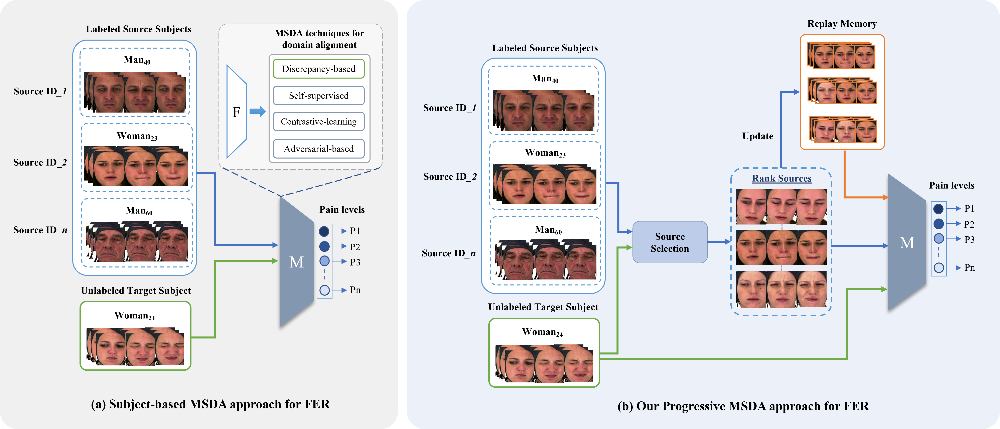
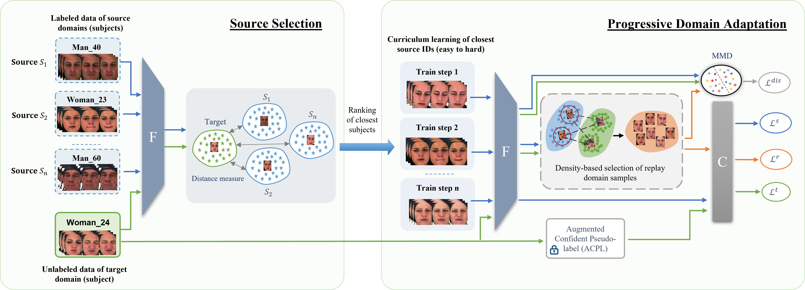

# Progrssive Multi-Source Domain Adaptation for Facial Expression Recognition 

Muhammad Osama Zeeshan<sup>1</sup>, Marco Pedersoli<sup>1</sup>, Alessandro Lameiras Koerich<sup>2</sup>, Eric Granger<sup>1</sup>

<sup>1</sup>LIVIA and ILLS, Dept. of Systems Engineering, ETS Montreal, Canada <br />
<sup>2</sup>Dept. of Software Engineering, ETS Montreal, Canada

# Domain Adaptation Setting
<p align="center">
  
</p>
(a) In subject-based MSDA, the model takes advantage of all the source domains during the target adaptation process and performs alignment using the discrepancy-based approach. (b) Our progressive MSDA method consists of two steps. First, we rank and gradually adapt source domains (subjects) based on their similarity to the target domain, optimizing the transfer process through sequential adaptation. Second, to address catastrophic forgetting, we construct a replay memory (domain) that retains key samples from previously adapted source domains, which are re-accessed after each source-target adaptation to maintain knowledge consistency. The discrepancy-based approach is applied to align the source and target domains.

# Progressive MSDA for FER
<p align="center">
  
</p>

Overview of our proposed progressive MSDA method for the adaptation to the target subject. \textbf{Source Selection Phase:} We estimate the similarity matrix between every source and target embedding, followed by ranking the sources from most to least similar subjects. \textbf{Progressive Domain Adaptation Phase:} 
Ranked sources are progressively incorporated through iterative training steps (\textit{Train Step-1}, \textit{Train Step-2}, ..., \textit{Train Step-n}). At each step, a new source subject is introduced and aligned with the target by calculating discrepancy and supervised losses. The Augmented Confident Pseudo-label (ACPL) technique from \cite{zeeshan2024subject} generates reliable pseudo-labels for the target. Finally, we create a replay dictionary using a density-based selection to preserve previously visited relevant source samples

# Installation

## Dependencies

### Using conda

```
conda create --name <env> --file <this file>
```

## Dependencies

### Using conda

```
conda env create -f environment.yml
```


### Using pip

```
pip install -r requirements.txt
```

## Biovid Pain and Heat Dataset

```
Biovid datasets PartA can be downloaded from here: (https://www.nit.ovgu.de/BioVid.html#PubACII17)
```

## UNBC-McMaster Shoulder Pain Dataset

```
UNBC-McMaster datasets can be downloaded from here: (https://sites.pitt.edu/~emotion/um-spread.htm)
```

## How to run the code

Run target adaptation training on Biovid or UNBC datasets

```
sh scripts/run.sh GPU=1 Top_s=10 

```

Run training on cross-dataset: Source -> UNBC-McMaster and Target -> Biovid

```
sh scripts/run_cross.sh GPU=1 Top_s=10 
```